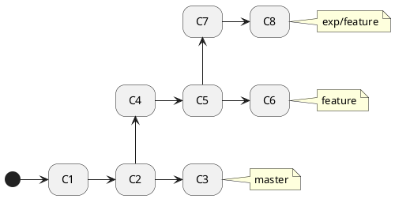

Есть три ветки


Можно, находясь в `master`, делать `rebase` ветки `exp/feature` поверх `feature`

```bash
$ git rebase --onto feature feature exp/feature
Successfully rebased and updated refs/heads/exp/feature.
```

